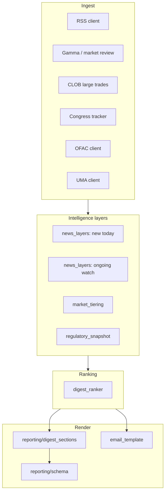

# Daily Digest Signal Quality — Design Spec

**Date:** 2026-05-31  
**Status:** Approved  
**Repo:** polymarket-osint-monitor  
**Priority track:** Signal quality (news, markets, regulatory)

## Problem

The daily digest technically runs, but **signal quality** underwhelms:

1. **News feels dead** — cross-day URL dedup yields zero fresh articles most days; the narrative opens with “no new stories” even when markets and regulatory context are active.
2. **Market flags feel noisy** — volume + low-probability rules surface sports, esports, and long-dated political markets alongside higher-value integrity signals.
3. **Regulatory sections lack synthesis** — Congress delta helps, but the regime picture (Congress + OFAC + UMA) is not summarized in one actionable glance.

Delivery and ops issues (email timing, duplicate sends, git push races) are addressed separately. This spec focuses on **what the digest communicates**.

## Goals

1. On RSS-quiet days, the digest still conveys **ongoing intelligence** (story threads + market/regulatory signal).
2. Email body prioritizes **HIGH/MEDIUM** market review signals; LOW-tier noise is collapsed.
3. A single **regulatory snapshot** synthesizes Congress, OFAC, and UMA status each day.
4. **Subject line and narrative** reflect the strongest cross-source signal, not only news.
5. **Source failures** (e.g. CLOB 401) are visible so absent data is not mistaken for quiet markets.

## Non-Goals (Phase 1)

- Full pipeline rewrite of `monitor.py` (deferred to Phase 3).
- External 7 AM scheduler (deferred; Eastern TZ already set on monitor step).
- Auto-discovery of new congressional bills via Congress.gov search.
- Committing `digest_email_sent.json` to the repository.
- Changing congress delta behavior (already shipped).

## Approach

**Layered intelligence (Approach A):** keep one daily email, add content layers and a cross-source ranker. Light preferences via optional `config/digest_preferences.yaml` in Phase 2.

---

## Architecture



### Module boundaries

| Module | Responsibility |
|--------|----------------|
| `detectors/news_layers.py` | Build `new_today` and `ongoing_watch` lists from RSS + `story_threads.json` |
| `detectors/market_tiering.py` | Split markets into `primary` (HIGH/MEDIUM) and `secondary` (LOW); apply promotion rules |
| `detectors/regulatory_snapshot.py` | Build congress + OFAC + UMA summary object and one-line synthesis |
| `detectors/digest_ranker.py` | Score cross-source candidates; return top items for narrative and subject |
| `reporting/digest_sections.py` | Plain-text section builders (decoupled from `monitor.py`) |
| `monitor.py` | Orchestration only: call clients → layers → ranker → save/send |

---

## 1. News layers

### New today (unchanged core)

- Fetch RSS, score, dedupe by URL against `data/seen_articles.json`.
- Persist new URLs after successful send (existing behavior).
- Section title: **New headlines today** (omit section if empty).

### Ongoing watch (new)

- Source: `data/story_threads.json` (existing `update_story_threads` fingerprint logic).
- Include thread when:
  - `mention_count >= 2`, and
  - `last_seen >= today - 7 days` (7-day window per approved default).
- Sort by `mention_count` desc, then `last_seen` desc.
- Cap at **3** threads in email; dashboard may show more.
- Display per thread:
  - Representative title (truncated)
  - `Day N` = `len(dates_seen)`
  - `Last update: {last_seen}`
  - No article URL re-send (avoid duplicating full story bodies).

### Story thread updates on quiet RSS days

- `update_story_threads()` still runs on `new_today` hits only (existing).
- Ongoing watch reads **historical** threads; does not require new articles today.

### Narrative when `new_today` is empty

- If `ongoing_watch` non-empty: lead with still-tracking line, then market/regulatory sentences.
- If `ongoing_watch` empty but markets/regulatory activity:  
  `"No new headlines today (prior digests covered RSS links)."` + market/regulatory detail.
- Never use the old bare `"No new news articles today — all recent stories have already been sent."` as the only line when other signals exist.

---

## 2. Market tiering

### Tiers (existing `insider_risk`)

| Tier | Email body | Notes |
|------|------------|-------|
| HIGH | Full card | Event-access criteria; near-term (≤30d close) boosted in ranker |
| MEDIUM | Full card | Review criteria |
| LOW | Count only in footer | Sports/long-dated/info-asymmetry; see dashboard |

### LOW promotion to body (stricter)

A LOW market appears in the **body** only if **any** of:

- Watchlist keyword/handle/wallet hit on linked news or market metadata, or
- Wash trading score ≥ configured threshold (reuse wash module verdict), or
- Volume ≥ `LOW_BODY_VOLUME_USD` (default **2_000_000**, overridable in preferences Phase 2).

Otherwise LOW markets appear only in footer:  
`+ N additional low-priority markets (mostly sports/long-dated) — see dashboard.`

### CLOB failure

- When `source_coverage.CLOB.status == failed`, narrative includes:  
  `"Large-trade scan unavailable (CLOB API error)."`
- Do not imply large-trade coverage is complete.

### Report schema

```python
{
  "markets_primary": [...],      # HIGH + MEDIUM (+ promoted LOW)
  "markets_secondary_count": 12,
  "markets_secondary": [...],    # optional in JSON for dashboard; omitted from email body
}
```

Backward compat: `suspicious_market_data` remains primary list; add fields above.

---

## 3. Regulatory snapshot

Single block after narrative, before market cards.

### Structure

```python
@dataclass
class RegulatorySnapshot:
    congress: BillTrackerResult          # existing delta tracker
    ofac_new: list[dict]
    uma_alerts: list[dict]
    synthesis: str                       # one sentence
    lines: list[dict]                    # per-source row for email table
```

### Synthesis examples

- All quiet:  
  `"Regulatory: no bill movement since 2026-03-26; no new OFAC crypto entries; no UMA Polymarket disputes."`
- Mixed:  
  `"Regulatory: 1 bill moved (S4226); no new OFAC entries; 2 UMA disputes."`

### Email layout

- Section: **Regulatory snapshot**
- One synthesis sentence (bold in HTML)
- Congress: change cards or quiet one-liner (existing congress delta UX)
- OFAC: section only if `ofac_new` non-empty (unchanged)
- UMA: section only if alerts non-empty (unchanged)

---

## 4. Cross-source digest ranker

### Candidates

| Type | Score basis |
|------|-------------|
| News (new) | `priority` bool, `score`, source priority weight |
| News (ongoing) | `mention_count * 2`, recency of `last_seen` |
| Market HIGH | base 100 + volume tier + near-term bonus |
| Market MEDIUM | base 60 + volume tier |
| Regulatory change | congress movement 80, OFAC new 90, UMA 70 |

### Outputs

```python
@dataclass
class DigestRankResult:
    narrative_lead: str           # first sentence
    subject_candidates: list[str]
    top_signals: list[dict]       # top 3 for optional "Today's top signals" bullet block
```

### Subject line priority

1. HIGH market near-term (existing logic, keep)
2. HIGH market event-access
3. New high-priority headline
4. Congress bill movement
5. OFAC new entry
6. Ongoing watch top thread (if no new news)
7. Fallback: market count or quiet day

---

## 5. Email section order

1. Header + stat grid (update labels: `New headlines`, `Ongoing watch`, `Markets for review`, `Bill movements`)
2. **Today's intelligence summary** (ranker output)
3. **Regulatory snapshot**
4. **Ongoing watch** (if any)
5. **New headlines today** (if any)
6. **Markets for review** (primary only)
7. Developing stories (if `last_seen == today` — keep existing gate)
8. On-chain, UMA detail, OFAC detail, wash, news general (existing conditional sections)
9. Footer: secondary market count + source health one-liner

### Source health one-liner

When any source `status == failed` in `source_coverage`:

`"Data gaps today: CLOB API (401), … — sections may be incomplete."`

---

## 6. Configuration (Phase 1 minimal)

Constants in `config.py` (preferences file in Phase 2):

```python
ONGOING_WATCH_MAX_DAYS = 7
ONGOING_WATCH_MAX_ITEMS = 3
LOW_BODY_VOLUME_USD = 2_000_000
```

---

## 7. Testing

| Test file | Coverage |
|-----------|----------|
| `tests/test_news_layers.py` | ongoing selection, caps, empty new + non-empty ongoing |
| `tests/test_market_tiering.py` | LOW collapse, promotion rules |
| `tests/test_regulatory_snapshot.py` | synthesis strings |
| `tests/test_digest_ranker.py` | subject/narrative priority ordering |
| `tests/test_report_contract.py` | new schema fields |

---

## 8. Phased delivery

| Phase | Deliverable |
|-------|-------------|
| **1a** | `news_layers` + narrative ranker integration |
| **1b** | `market_tiering` + email section order |
| **1c** | `regulatory_snapshot` + source health line |
| **1d** | `digest_sections` extraction + dashboard tweaks |
| **2** | `digest_preferences.yaml` + TTL on seen articles (optional) |
| **3** | Pipeline refactor + PMIDS client sharing |

---

## Success criteria (acceptance)

- [ ] RSS-empty day with active threads shows **Ongoing watch** section (≥1 item when threads qualify).
- [ ] RSS-empty day with HIGH market leads narrative with market, not “no news” only.
- [ ] Email body excludes LOW markets unless promotion rules match.
- [ ] Regulatory snapshot appears every day with accurate one-line synthesis.
- [ ] Subject line matches ranker #1 signal on test fixtures.
- [ ] CLOB failed → narrative mentions data gap.
- [ ] All unit tests pass in CI with `PYTHONPATH=src`.

---

## References

- Prior spec: `docs/superpowers/specs/2026-05-30-congress-delta-design.md`
- Implementation plan: `docs/superpowers/plans/2026-05-31-signal-quality.md` (created after this spec)
